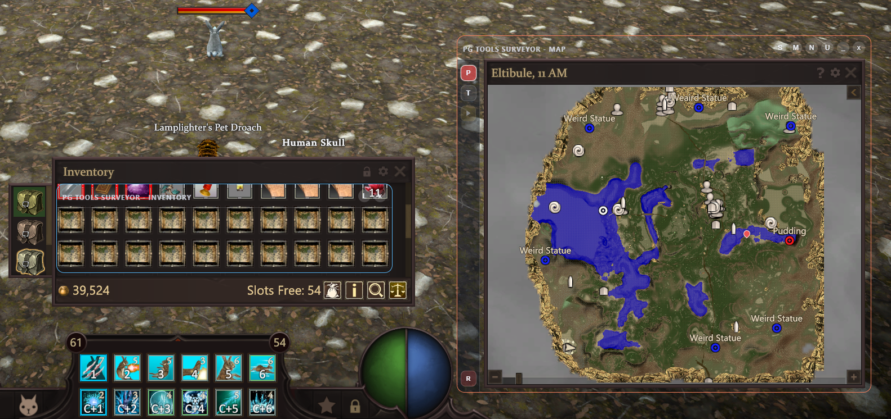
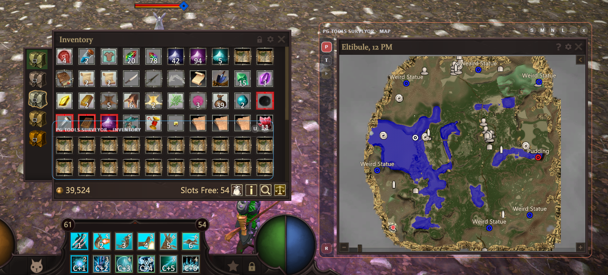
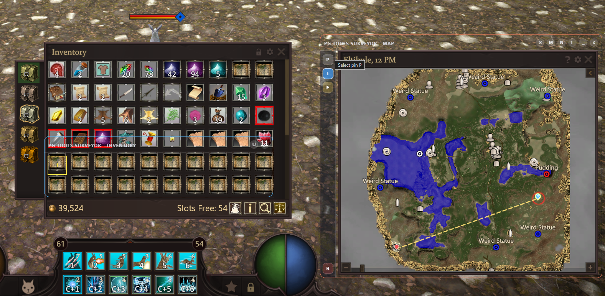
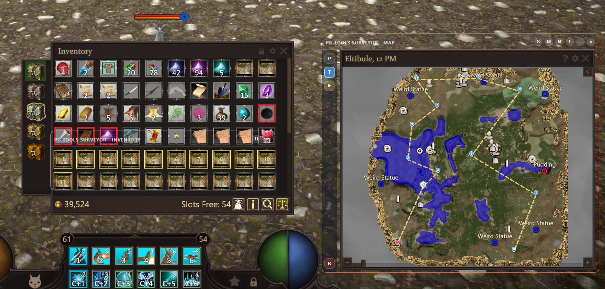
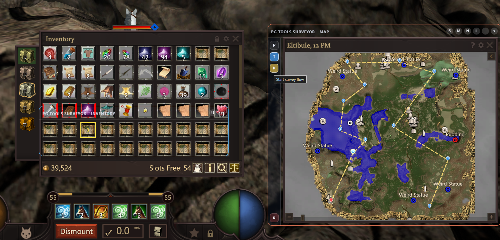
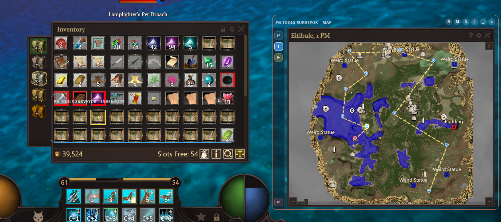
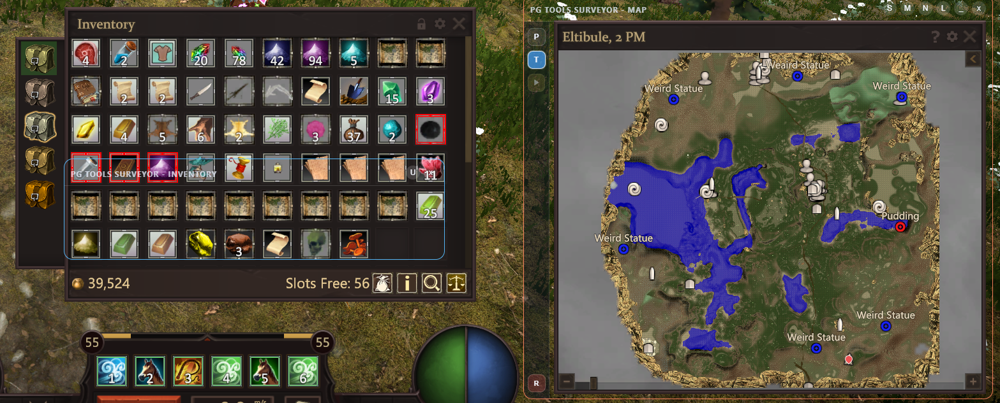

# Surveyor

For the surveyor tool, you'll have two windows pop up. These are the inventory and map windows. You can either use both of them or only the map window.

First position both windows over their their respective namesakes. Map window goes over the map and the inventory goes over the inventory. You'll want to resize the inventory window so it's top-left corner is aligned to your survey or treasure maps.

It's important to note that the maps NEED to be in the first column of your inventory. The default is a 10 column inventory, but you can change that in the settings of pg-tools.

Here's how it will look like:

Now, lets add the player (P) pin to the map. I'm right at casino entrance, so i'll place it there:

Now lets add all of the target (T) pins. Use a survey map, place the pin where it indicates where the target is:

(If the yellow box is not correctly aligned to the survey map, just reposition the window. The size, color, gap and border thickness can be changed in settings)

Keep doing it until all desired targets are marked on the map window:

Click on the start button to init survey flow:

From here on foward, go to the indicated spot and use the survey map highlighted by the yellow box. After you get your target, click on the current pin to remove it and update your player location. The next target then becomes highlighted:

After you finish collecting all the targets, press the reset button (R) to start another survey flow:

